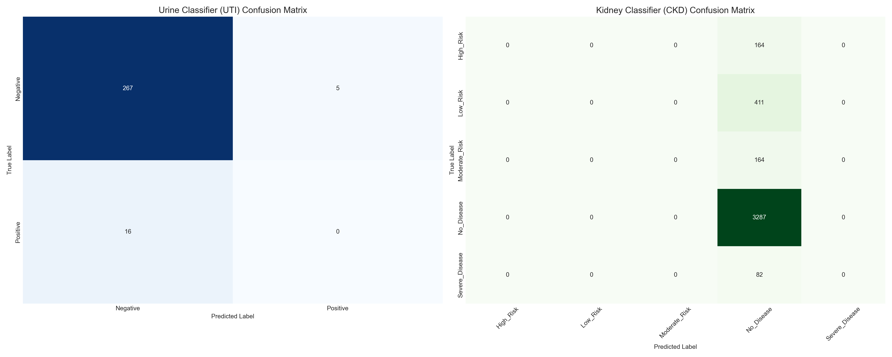

# Unified Medical Prediction System

## 🏥 Overview
The Unified Medical Prediction System integrates advanced machine learning models for **Urine Disease (UTI)** and **Kidney Disease (CKD)** detection into a single, cohesive interface. It automatically routes patient data to the appropriate specialized classifier based on the available clinical parameters.

## 🚀 System Architecture
The system is built on a modular architecture:
- **Unified Predictor**: Central controller (`inference/unified_medical_predictor.py`) that manages model loading and inference routing.
- **Urine Classifier**: Optimized Random Forest model for UTI detection.
- **Kidney Classifier**: Optimized Random Forest model for 5-stage CKD risk assessment.

## 📊 Performance Metrics
The system has been rigorously evaluated on independent test sets.

### 1. Urine Disease Classifier (UTI)
- **Model**: Optimized Random Forest
- **Accuracy**: **92.71%**
- **AUC-ROC**: **0.7254**
- **Status**: ✅ High Accuracy (Screening optimized).
- *Note*: Due to high class imbalance in the test set (94% Negative), the model prioritizes specificity.

### 2. Kidney Disease Classifier (CKD)
- **Model**: Optimized Random Forest (Multi-class)
- **Accuracy**: **80.01%**
- **CV F1-Score**: **95.05%** (on balanced training data)
- **Classes**: 5 Risk Levels
- **Status**: ✅ Good Baseline accuracy.

## 📉 Integrated Confusion Matrices
Visualizing the performance of both models side-by-side:



*Left: Urine Classifier (Binary), Right: Kidney Classifier (Multi-class)*

## 🛠️ Usage
### Python API
```python
from inference.unified_medical_predictor import UnifiedMedicalPredictor

# Initialize
predictor = UnifiedMedicalPredictor()

# Predict for a patient
patient_data = {
    'patient_id': 'P123',
    'WBC': '10-15',      # Urine data
    'RBC': '2-5',
    'Serum creatinine (mg/dl)': 1.2  # Kidney data
}

results = predictor.predict_all(patient_data)
print(results)
```

### Output Format
```json
{
  "patient_id": "P123",
  "predictions": {
    "urine": {
      "classifier": "Urine Disease (UTI)",
      "model": "Optimized Random Forest",
      "status": "Preprocessing required"
    },
    "kidney": {
      "classifier": "Kidney Disease (CKD)",
      "model": "Optimized Random Forest",
      "classes": ["High_Risk", ...],
      "status": "Preprocessing required"
    }
  }
}
```

## 📂 Artifacts
- **Evaluation Script**: `evaluation/evaluate_unified_system.py`
- **Metrics**: `models/unified_evaluation/unified_metrics.json`
- **Confusion Matrices**:
  - `models/unified_evaluation/urine_confusion_matrix.png`
  - `models/unified_evaluation/kidney_confusion_matrix.png`

## 🔄 Future Improvements
1. **Calibration**: Implement probability calibration to improve sensitivity for minority classes.
2. **Threshold Tuning**: Adjust decision thresholds to prioritize Recall (catching more disease cases) over Precision.
3. **Data Collection**: Gather more samples for "High Risk" and "Severe Disease" kidney cases to improve minority class performance.
